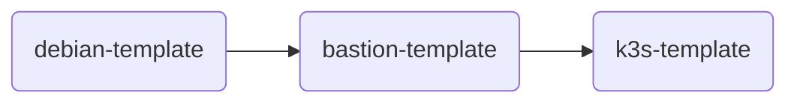

# Packer
## Template dependencies
You must build the template in this order:

1. `debian-template`
2. `bastion-template`
3. `k3s-template`
   

## Command
You can use the following command to build the template:
```bash
packer build -var 'pm_api_url=https://{{ PROXMOX_IP }}:8006/api2/json' -var 'pm_api_token_id={{YOUR_TOKEN}}' -var 'pm_api_token_secret={{ YOUR_SECRET_API_TOKEN}}' -var 'pm_tls_insecure=true' -var 'pm_host={{YOUR_PROXMOX_HOST}}' -var 'guest_username={{YOUR_GUEST_HOSTNAME}}' -var 'local_ip={{LOCAL_IP_WHERE_YOU_RUN_PACKER}}' -var 'local_port={{AN_AVAILABLE_PORT_ON_YOUR_LOCAL_IP}}' -var "ssh_public_key=$(cat ~/.ssh/id_rsa.pub | tr -d '\n')" -var 'domain={{YOUR_DOMAIN}}' -debug -force debian-template.pkr.hcl

```
Tips for WSL:
Command to redirect local port to WSL:
```bash
netsh interface portproxy add v4tov4 listenport=1712 listenaddress=0.0.0.0 connectport=1712 connectaddress={{ YOUR_WSL_IP }}
```